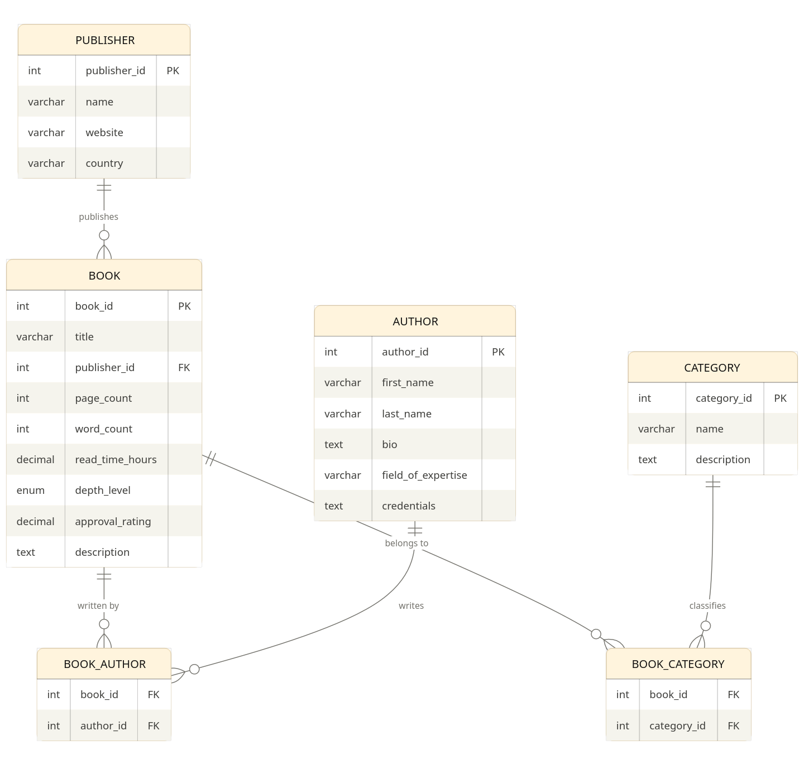

# Book-Database
# 📚 Book Tracker Database

A command-line application for tracking nonfiction personal development books. Users can add books, authors, and categories, search and filter the collection, and manage records through a simple text menu. Built with Python and MySQL.

---

## Entity Relationship Diagram



The database uses six tables. `PUBLISHER` connects to `BOOK` in a one-to-many relationship (one publisher releases many books). `BOOK` and `AUTHOR` connect through the `BOOK_AUTHOR` junction table in a many-to-many relationship, since a book can have multiple authors and an author can write multiple books. `BOOK` and `CATEGORY` work the same way through `BOOK_CATEGORY`, since a book can belong to multiple categories like Habits, Psychology, and Mindset at the same time.

---

## Setup Instructions

### Requirements
- Python 3.8 or higher
- Docker Desktop (to run MySQL)

---

### Step 1 — Start the MySQL Docker Container

If you are running this for the first time:

```bash
docker run --name books -p 3306:3306 -e MYSQL_ROOT_PASSWORD=password -d mysql:latest
```

If the container already exists, just start it:

```bash
docker start privilege-lab
```

---

### Step 2 — Load the Database

Run these two commands in order from the project folder:

```bash
# Create all the tables
docker exec -i privilege-lab mysql -uroot -ppassword < schema.sql

# Load the sample data
docker exec -i privilege-lab mysql -uroot -ppassword < data.sql
```

To verify it worked:

```bash
docker exec -it privilege-lab mysql -uroot -ppassword book_tracker -e "SELECT title FROM book LIMIT 5;"
```

---

### Step 3 — Install Python Dependencies

```bash
pip install mysql-connector-python
```

---

### Step 4 — Run the App

```bash
python main.py
```

---

## File Structure

```
Book-Database/
├── schema.sql      # Creates all tables and indexes
├── data.sql        # Inserts sample books, authors, publishers, categories
├── queries.sql     # Standalone demo queries you can run in MySQL directly
├── main.py         # Runs the app and handles all user menus
├── database.py     # All database connection and query functions
└── README.md       # This file
```

---

## Table Descriptions

| Table | What it stores |
|---|---|
| `book` | Every book record — title, page count, word count, read time, depth level, rating, and description |
| `author` | Author info — name, bio, field of expertise, and credentials |
| `publisher` | Publisher name, website, and country |
| `category` | Category labels like Habits, Psychology, Leadership, and their descriptions |
| `book_author` | Junction table linking books to authors (handles many-to-many) |
| `book_category` | Junction table linking books to categories (handles many-to-many) |

### Depth Level Field
Books are tagged with one of three depth levels:
- `broad` — covers a topic at a surface level, good for an overview
- `moderate` — balanced mix of depth and accessibility
- `in-depth` — goes deep into the subject, denser read

---

## Features

### Create
- Add a new book with title, publisher, page count, word count, read time, depth, rating, and description
- Add a new author with bio, field of expertise, and credentials
- Link a book to an author immediately after adding it (uses a database **transaction** — if anything fails, the whole operation rolls back)

### Read (4 search options)
- View all books sorted by approval rating
- Search books by category name (partial match — typing "Psych" finds "Psychology")
- Filter books by a minimum rating
- View all authors with their expertise

### Update
- Update a book's approval rating
- Update an author's credentials

### Delete
- Delete a book (requires typing `yes` to confirm)
- Delete an author (requires typing `yes` to confirm)
- Deleting a book automatically removes its links in `book_author` and `book_category` due to `CASCADE` rules

---

## Example Usage

### Starting the App
```
Welcome to the Book Tracker!
Successfully connected to the database.

===== MAIN MENU =====
C - Create (add books/authors)
R - Read   (search/view)
U - Update (edit records)
D - Delete (remove records)
Q - Quit
Choice:
```

### Viewing All Books
```
Choice: r

-- Read Menu --
1. View all books
2. Search by category
3. Search by minimum rating
4. View all authors
0. Back
Choice: 1

-- All Books (sorted by rating) --
  ID 9  | The Power of Habit              | Rating: 9.4 | in-depth  | 8.0 hrs
  ID 5  | Mindset                         | Rating: 9.3 | in-depth  | 6.5 hrs
  ID 2  | Daring Greatly                  | Rating: 9.2 | in-depth  | 6.0 hrs
  ID 14 | Flow                            | Rating: 9.2 | in-depth  | 6.5 hrs
  ID 7  | The Black Swan                  | Rating: 9.1 | in-depth  | 9.0 hrs
```

### Searching by Category
```
Choice: 2

-- Search Books by Category --
Enter category name (e.g. Psychology, Habits): Habits
  The Power of Habit | Category: Habits | Rating: 9.4
```

### Adding a Book
```
Choice: c

-- Add a New Book --
Book title: Atomic Habits

Available publishers:
  ID 5: Portfolio
Enter publisher ID: 5
Page count: 320
Word count: 80000
Estimated read time in hours: 6.0
Depth level: in-depth
Approval rating (0-10): 9.5
Short description: Tiny changes, remarkable results.
Book added! Book ID is 16
Do you want to link an author to this book? (yes/no): yes

Available authors:
  ID 1: Simon Sinek
  ID 2: Brene Brown
Enter author ID: 1
Book and author linked successfully.
```

### Deleting a Book
```
-- Delete a Book --
  ID 4 | The 4-Hour Workweek | Rating: 8.5 | broad | 7.0 hrs
Enter book ID to delete: 4
Are you sure you want to delete book 4? (yes/no): yes
Book deleted.
```

---

## Known Bugs and Limitations

**No duplicate checking** — You can add the same book twice. The app does not check if a title already exists before inserting.

**Publisher ID must be known** — When adding a book, the app lists publishers but does not let you add a new one on the spot. New publishers must be added directly in MySQL.

**No category linking on book creation** — You can link an author right after adding a book, but not a category. Categories must be linked separately through MySQL.

**Author delete may fail** — If an author is still linked to a book in `book_author`, the delete will fail with a foreign key error. Delete the book first, or the cascade will handle it automatically.

**No input length limits** — The app checks that numbers are numbers, but does not check if a title or bio is too long for the database column.

**Rating update not validated in Python** — When updating a rating, the app accepts any float. Entering 11 or -1 will be rejected by the database `CHECK` constraint, but the error shown is a raw MySQL message rather than a friendly one.